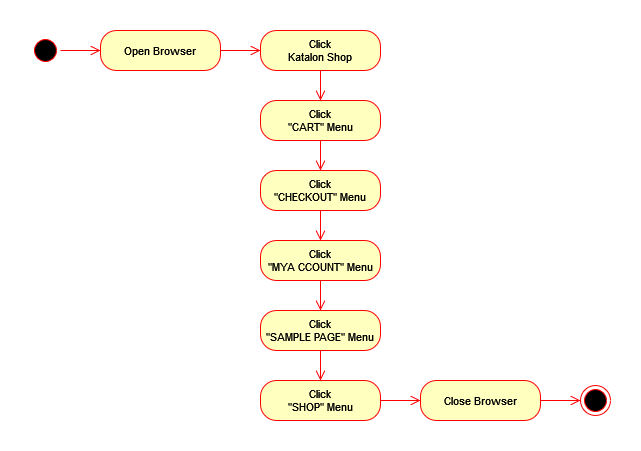

# Katalon's XPath Performance Comparison on Shopping Cart Web

## Description

This is a simple experimental project for comparing katalon test performance, between test suite which using test object xpath purely from spy result to test suite which using test object with reduced xpath criteria.

## Test Plan

### Covers

Target web: <https://cms.demo.katalon.com/>

Collecting test duration of test case clicking menu and verify page changing:

1. Katalon Shop
2. CART
3. CHECKOUT
4. MY ACCOUNT
5. SAMPLE PAGE
6. SHOP

Prepared test object:

1. Test object with complete criteria given by spying procedure
2. Test object with reduced xpath criteria (Simple XPath)

Web browser:

1. Chrome (Headless)
2. Firefox (Headless)

### Test Strategy

1. Run test suite collection *Test Suites/Spy Result VS Simple XPath Collection*.
    Execution Mod:
        - Parallel
        - Max concurrent instances: 6
2. Run #1 few times
3. Analyze and view performance comparison in jupiter notebook file [analysis/test-result.ipynb](./analysis/test-result.ipynb)
    Related: [Test Result Analysis's README](./analysis/README.md)

### Risk

1. Internet connection not fast enough
    * Control:
        1. Limit concurrent instances to 6, equals to test suite's count per browser
    * Mitigation:
        1. Reduce concurrent instances
        2. Change execution mod to *Sequential*
1. System's Memory (RAM) not enough to run
    * Control:
        1. Limit concurrent instances to 6, equals to test suite's count per browser
        2. Using headless browser
    * Mitigation:
        1. Reduce concurrent instances
        1. Change execution mod to *Sequential*

### Test Case

Basically all test case doing same things, with some variations.

## Test Result

No sample test result will be included in this repository, but a sample analyzed result is planned to be included as a documentation.
